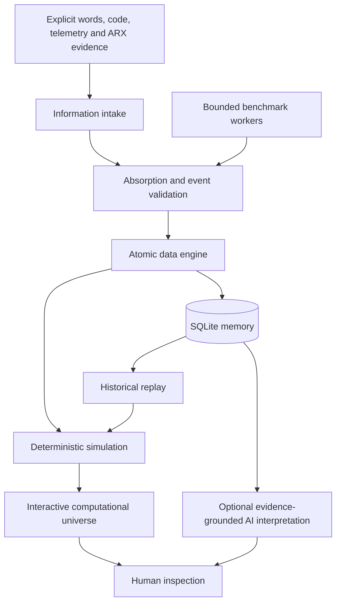

# Architecture diagram

```mermaid
flowchart TD
    Sources[Explicit words, code, telemetry and ARX evidence] --> Intake[Information intake]
    Intake --> Absorb[Absorption and event validation]
    Absorb --> Atomic[Atomic data engine]
    Atomic --> Memory[(SQLite memory)]
    Bench[Bounded benchmark workers] --> Absorb
    Atomic --> Sim[Deterministic simulation]
    Sim --> Visual[Interactive computational universe]
    Memory --> Replay[Historical replay]
    Replay --> Sim
    Visual --> Human[Human inspection]
    Memory --> AI[Optional evidence-grounded AI interpretation]
    AI --> Human
```

This is a proposed software data flow, not a physical energy diagram.
